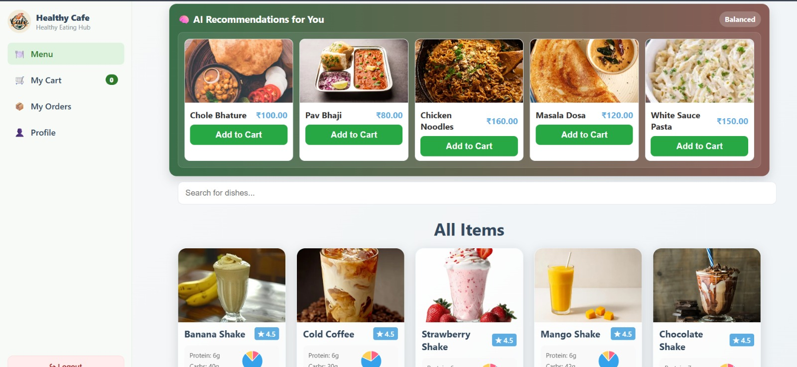
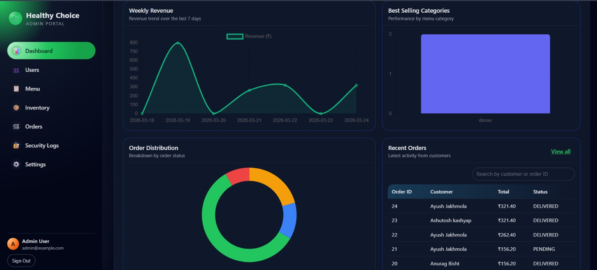
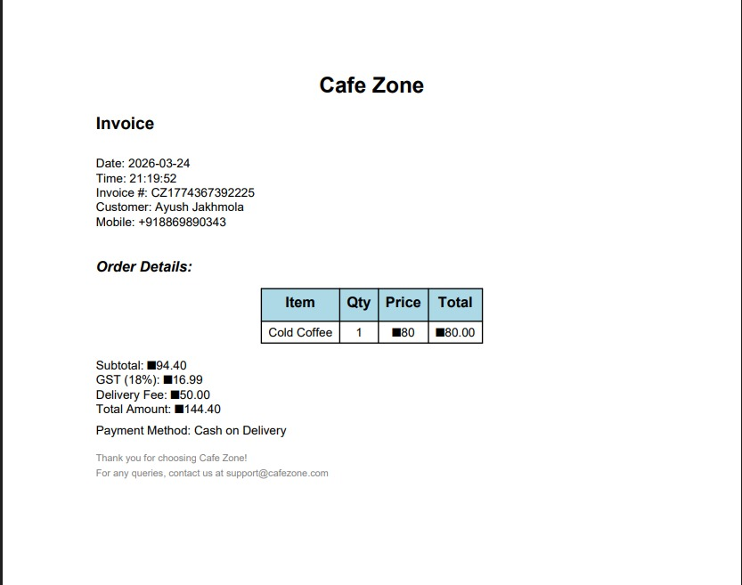

# 🥗 Healthy Choice Cafe Management System
### *with AI Recommendations Engine*

<div align="center">


*A full-stack cafeteria management web application featuring AI-powered food recommendations, OTP-verified invoice generation, real-time order tracking, and a comprehensive admin dashboard.*

</div>

---

## 📸 Screenshots

| Cafeteria Menu | Admin Dashboard | Invoice |
|:-:|:-:|:-:|
|  |  |  |

---

## ✨ Features

### 👤 Customer Side
- **User Registration & Login** — Secure authentication with bcrypt password hashing and OTP verification
- **Smart Menu** — Browse Indian cuisine with veg/non-veg filters, calorie info, and macros
- **AI Food Chatbot** — Age + weight based food recommendations from the live menu database (no API cost)
- **Shopping Cart** — Add items, view nutrition summary, and manage quantities
- **OTP-Verified Payment** — Enter mobile number → receive OTP → verify → download invoice
- **PDF Invoice** — Auto-generated professional invoice with cafe logo watermark on payment
- **Order Tracking** — Real-time order status: Pending → Preparing → Ready → Delivered
- **Profile Dashboard** — View nutrition history, health coins, macros pie chart, and AI recommendations
- **Health Coins** — Earn 10 coins per healthy item ordered

### 🛠️ Admin Side
- **Dashboard** — Revenue charts, order distribution, category analytics, best-selling items
- **Menu Management** — Add, edit, delete, and toggle menu items with images
- **Order Management** — Update order status, view all orders with filters
- **Inventory Tracking** — Monitor ingredient levels with low-stock alerts
- **User Management** — View all registered users and their order history
- **Security Logs** — Track login history and IP addresses
- **Settings** — Configure cafe name, GST rate, delivery fee, and more

---

## 🏗️ Project Architecture

```
┌─────────────────────────────────────────────────────┐
│                    USERS                            │
│         Customer              Admin                 │
└──────────────┬──────────────────┬───────────────────┘
               │                  │
┌──────────────▼──────────────────▼───────────────────┐
│                  FRONTEND (HTML/CSS/JS)              │
│  cafeteria │ cart │ payment │ profile │ orders       │
│  admin: dashboard │ menu │ orders │ inventory        │
└──────────────────────────┬──────────────────────────┘
                           │ HTTP / REST API
┌──────────────────────────▼──────────────────────────┐
│              FLASK BACKEND (app.py)                  │
│  Auth    │ Menu      │ Orders   │ Payment  │ Admin   │
│  /login  │ /food-items│ /create │ /send-otp│ /admin/ │
│  /register│ /menu    │ /save   │ /verify  │ dashboard│
│  /send-otp│ /recos   │ /status │ /generate│ /orders  │
│                                                      │
│  Middleware: Flask-Limiter · bcrypt · CORS · Session │
└──────┬───────────┬──────────┬──────────┬────────────┘
       │           │          │          │
┌──────▼──┐  ┌─────▼────┐ ┌──▼──────┐ ┌▼──────────┐
│  MySQL  │  │ ReportLab│ │scikit-  │ │  OTP      │
│  DB     │  │ PDF Gen  │ │learn AI │ │  Service  │
│ 6 tables│  │ Invoices │ │ Recos   │ │Fast2SMS / │
└─────────┘  └──────────┘ └─────────┘ │  Screen   │
                                       └───────────┘
```

---

## 🗄️ Database Schema

```sql
users         — id, name, email, mobile, password_hash, role, dob, gender, health_coins
menu_items    — id, name, price, image_url, protein, carbs, fats, calories, diet_type
orders        — id, user_id, total_amount, order_status, payment_status, created_at
order_items   — id, order_id, menu_item_id, quantity, price
inventory     — id, ingredient_name, quantity, threshold
login_otp     — id, user_id, otp_code, expiry_time
login_history — id, user_id, login_time, ip_address
system_settings — setting_key, setting_value
```

---

## 🚀 Getting Started

### Prerequisites

- Python 3.10+
- MySQL 8.0+
- pip

### Installation

```bash
# 1. Clone the repository
git clone https://github.com/yourusername/healthy-cafe-management.git
cd healthy-cafe-management

# 2. Create virtual environment
python -m venv venv
source venv/bin/activate        # Linux/Mac
venv\Scripts\activate           # Windows

# 3. Install dependencies
pip install -r requirements.txt

# 4. Set up MySQL database
mysql -u root -p
CREATE DATABASE healthy_cafe;
USE healthy_cafe;
source schema.sql;

# 5. Configure environment variables
cp .env.example .env
# Edit .env with your database credentials

# 6. Run the application
python app.py
```

### Environment Variables

Create a `.env` file in the root directory:

```env
DB_HOST=localhost
DB_USER=root
DB_PASSWORD=your_mysql_password
DB_NAME=healthy_cafe

SECRET_KEY=your_secret_key_here

MAIL_USERNAME=your_email@gmail.com
MAIL_PASSWORD=your_app_password
```

---

## 📁 Project Structure

```
healthy-cafe/
│
├── app.py                    # Main Flask application (all routes + logic)
├── requirements.txt          # Python dependencies
├── schema.txt                # Database schema reference
│
├── templates/                # HTML templates (Jinja2)
│   ├── login.html
│   ├── register.html
│   ├── cafeteria.html        # Main menu page + AI chatbot
│   ├── cart.html
│   ├── payment.html          # OTP flow + invoice download
│   ├── orders.html
│   ├── profile.html          # Nutrition dashboard + AI recommendations
│   └── admin/
│       ├── dashboard.html    # Revenue charts + analytics
│       ├── menu.html
│       ├── orders.html
│       ├── inventory.html
│       ├── users.html
│       ├── security_logs.html
│       └── settings.html
│
└── static/
    ├── style.css             # Main stylesheet
    ├── script.js             # Frontend JavaScript
    ├── admin.css
    ├── admin.js
    └── images/               # Food item images + cafe logo
```

---

## 🤖 AI Features

### 1. Menu Chatbot (No API cost)
The floating chatbot on the cafeteria page asks users for their **age** and **weight**, calculates BMI, and recommends the best menu items based on health profile:

| Age Group | BMI Category | Recommendation Logic |
|-----------|--------------|----------------------|
| 5–12 yrs | Any | Light, veg, low calorie |
| 13–17 yrs | Any | High protein + energy foods |
| 18+ | Underweight (< 18.5) | High calorie + high protein |
| 18+ | Normal (18.5–24.9) | Balanced macro items |
| 18+ | Overweight (25–29.9) | Low calorie + low fat |
| 18+ | Obese (30+) | Very low calorie, diet items |
| 50+ | Any | Light, easy to digest |

### 2. AI Profile Recommendations
On the profile page, the system analyzes past order history using **scikit-learn** collaborative filtering to suggest new menu items the user is likely to enjoy.

---

## 💳 Payment Flow

```
User selects UPI / Google Pay
          │
          ▼
Enter 10-digit mobile number
          │
          ▼
Click "Send OTP"  ──► OTP generated (server-side, stored 5 min)
          │               │
          │               ▼
          │         OTP displayed on screen  (or SMS via Fast2SMS)
          ▼
Enter 6-digit OTP
          │
          ▼
Verify OTP  ──► ✅ Verified
          │
          ▼
Invoice auto-generated (ReportLab PDF)
          │
          ▼
⬇ Download Invoice
```

---

## 📦 Tech Stack

| Layer | Technology |
|-------|-----------|
| Backend | Flask 2.3.3, Python 3.12 |
| Database | MySQL 8.0 + mysql-connector-python |
| Frontend | HTML5, CSS3, Vanilla JavaScript, Chart.js |
| Authentication | bcrypt, Flask sessions, OTP verification |
| PDF Generation | ReportLab 4.0.4 |
| AI / ML | scikit-learn 1.3, pandas 2.0 |
| Security | Flask-Limiter (rate limiting), Flask-CORS |
| Email | Flask-Mail |
| Password | bcrypt 4.0.1 |

---

## 🔒 Security Features

- **Password Hashing** — bcrypt with salt rounds
- **Rate Limiting** — Flask-Limiter prevents brute force attacks
- **OTP Expiry** — OTPs expire in 5 minutes and are single-use
- **Session Management** — Server-side sessions with secret key
- **Login History** — All login attempts logged with IP and timestamp
- **Password Policy** — 8–12 chars, uppercase, number, special character required
- **Admin Separation** — Admin routes protected by separate session check

---

## 📊 Admin Dashboard Features

- **Revenue Chart** — Daily/weekly revenue trends (Chart.js)
- **Order Distribution** — Pie chart by category (Veg/Non-veg/Beverage)
- **Best Selling Items** — Top items by order count
- **Recent Orders** — Live order table with status updates
- **Inventory Alerts** — Low stock warnings below threshold
- **Category Analytics** — Sales breakdown by food category

---

## 🤝 Contributing

1. Fork the repository
2. Create your feature branch (`git checkout -b feature/AmazingFeature`)
3. Commit your changes (`git commit -m 'Add some AmazingFeature'`)
4. Push to the branch (`git push origin feature/AmazingFeature`)
5. Open a Pull Request

---

## 📄 License

This project is licensed under the MIT License — see the [LICENSE](LICENSE) file for details.

---

## 👨‍💻 Author

**Your Name**
- GitHub: [@yourusername](https://github.com/yourusername)
- Email: your.email@example.com

---

<div align="center">

⭐ **Star this repo if you found it helpful!** ⭐

*Built with ❤️ for healthy eating and smart cafe management*

</div>
